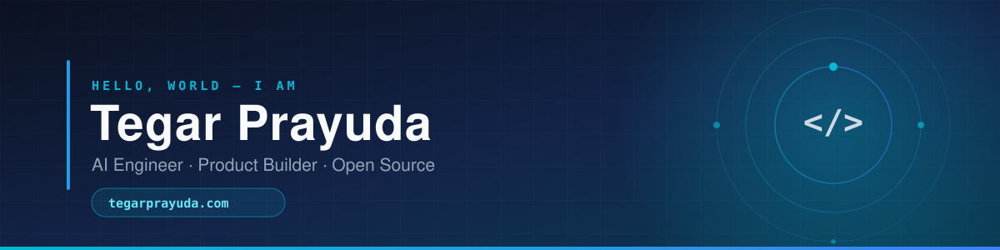

<div align="center">
  <a href="https://tegarprayuda.com">
    
  </a>
</div>

<div align="center">

[](https://tegarprayuda.com)
[](mailto:tegarprayuda3@gmail.com)
[](https://github.com/TegarTheGreat)
[](https://github.com/TegarTheGreat?tab=followers)

</div>

---

## About Me

I build at the intersection of **AI and product** — autonomous agents, prompt systems,
and developer tools that turn messy human intent into software that actually works.
Most of what lives here started as a problem I had, and stayed because other people had it too.

```ts
const tegar = {
  role:       "AI Engineer & Product Builder",
  website:    "https://tegarprayuda.com",
  focus:      ["LLM agents", "prompt engineering", "developer tooling", "automation"],
  languages:  ["TypeScript", "Python", "JavaScript", "PHP"],
  building:   ["SuperMD — anti-slop system prompts", "DalangAI — AI video editor"],
  philosophy: "Ship small, ship often, keep the quality bar high.",
};
```

- Currently deep in **LLM agents, prompt architecture, and AI-assisted workflows**
- Shipping in **TypeScript** and **Python**, wired up with **Node.js** and **React**
- Open to collaborating on **AI tooling** and **product experiments**
- More about my work at **[tegarprayuda.com](https://tegarprayuda.com)**

---

## Tech Stack

<div align="center">

**Languages**


**Frameworks & Runtime**


**AI & Automation**


**Tooling & Infra**


</div>

---

## Featured Projects

<table>
<tr>
<td width="50%" valign="top">

### [SuperMD](https://github.com/TegarTheGreat/SuperMD)

A universal **anti-slop system prompt** — composable rules that keep LLM output sharp,
specific and free of filler. Works across Claude, GPT and Codex-style agents.


[](https://github.com/TegarTheGreat/SuperMD/stargazers)

</td>
<td width="50%" valign="top">

### [DalangAI](https://github.com/TegarTheGreat/DalangAI)

An **AI-powered video editor** — turns raw footage and a brief into an edited cut,
the way a *dalang* directs the whole show from behind the screen.


[](https://github.com/TegarTheGreat/DalangAI/stargazers)

</td>
</tr>
<tr>
<td width="50%" valign="top">

### [SotongAssistant](https://github.com/TegarTheGreat/SotongAssistant)

A **Telegram group assistant** built on Telegraf — moderation, summaries and
on-demand answers for busy group chats.


[](https://github.com/TegarTheGreat/SotongAssistant/stargazers)

</td>
<td width="50%" valign="top">

### [QuidChat](https://github.com/TegarTheGreat/QuidChat)

A **chat application** on a modern TypeScript stack — real-time messaging,
clean UI, MIT-licensed and open to contributions.


[](https://github.com/TegarTheGreat/QuidChat/stargazers)

</td>
</tr>
</table>

<div align="center">

[](https://github.com/TegarTheGreat?tab=repositories)

</div>

---

## GitHub Stats

<!--
  These two cards are rendered by the shared public github-readme-stats instance.
  If they ever show "Maximum retries exceeded", it is upstream rate limiting, not a
  broken link. Fix: deploy your own instance (free) and swap the hostname below.
  https://github.com/anuraghazra/github-readme-stats#deploy-on-your-own-vercel-instance
-->

<div align="center">


</div>

---

## Let's Build Something

I read and answer every serious message — whether it is a collaboration, a bug in one of
my projects, or an idea you want a second pair of eyes on.

<div align="center">

[](https://tegarprayuda.com)
[](mailto:tegarprayuda3@gmail.com)

<sub>Built with care · <a href="https://tegarprayuda.com">tegarprayuda.com</a></sub>

</div>
