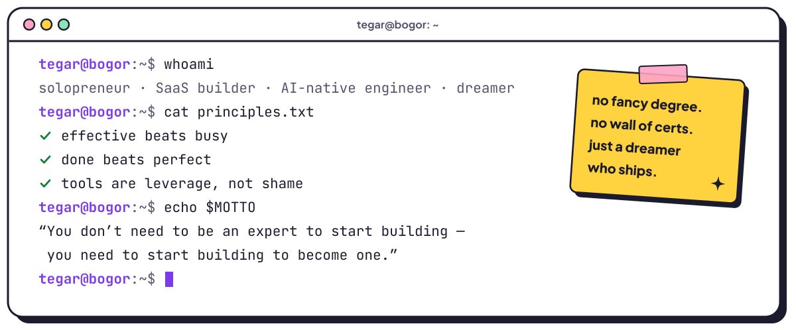
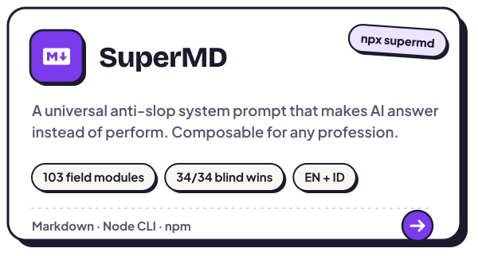
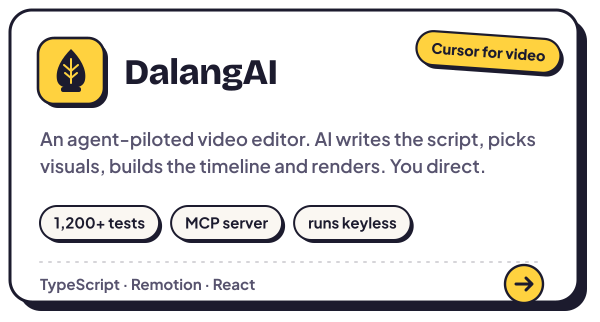
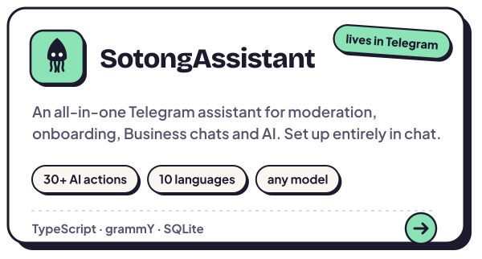
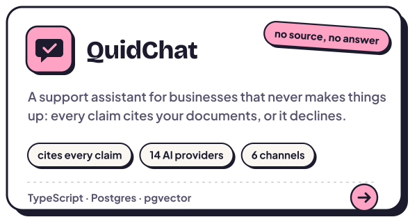

<!--
  Profile README for github.com/TegarTheGreat
  - Every SVG in assets/ is generated by scripts/build_assets.py. Edit the copy there and re-run it.
  - The blog list between the BLOG markers is refreshed daily by .github/workflows/blog.yml.
  - The snake is drawn by .github/workflows/snake.yml and published to the `output` branch.
-->

<a href="https://tegarprayuda.com">
  <picture>
    <source media="(prefers-color-scheme: dark)" srcset="assets/banner-dark.svg">
    
  </picture>
</a>

  <a href="https://tegarprayuda.com"><picture><source media="(prefers-color-scheme: dark)" srcset="assets/btn-website-dark.svg"></picture></a>
  <a href="https://www.linkedin.com/in/tegar-prayuda"><picture><source media="(prefers-color-scheme: dark)" srcset="assets/btn-linkedin-dark.svg"></picture></a>
  <a href="https://www.youtube.com/@tegarpryd"><picture><source media="(prefers-color-scheme: dark)" srcset="assets/btn-youtube-dark.svg"></picture></a>
  <a href="https://www.tiktok.com/@tegarpryd"><picture><source media="(prefers-color-scheme: dark)" srcset="assets/btn-tiktok-dark.svg"></picture></a>

### 👋 Halo, I'm Tegar

A solopreneur from Bogor who builds anything on the internet, alone, the AI-native way.
I own the architecture, the decisions and the quality bar; AI does the typing. I'm in my final
semester of Business Management, so the business side gets its theory while the building side
gets real-world reps.

<picture>
  <source media="(prefers-color-scheme: dark)" srcset="assets/about-dark.svg">
  
</picture>

### 🧪 Things I've built

Open source, built solo, and documented like a whole team is watching. The common thread: **AI you can trust** — it cites, it measures itself, and it says so when it doesn't know.

  <a href="https://github.com/TegarTheGreat/SuperMD"><picture><source media="(prefers-color-scheme: dark)" srcset="assets/project-supermd-dark.svg"></picture></a>
  <a href="https://github.com/TegarTheGreat/DalangAI"><picture><source media="(prefers-color-scheme: dark)" srcset="assets/project-dalangai-dark.svg"></picture></a>
  <a href="https://github.com/TegarTheGreat/SotongAssistant"><picture><source media="(prefers-color-scheme: dark)" srcset="assets/project-sotongassistant-dark.svg"></picture></a>
  <a href="https://github.com/TegarTheGreat/QuidChat"><picture><source media="(prefers-color-scheme: dark)" srcset="assets/project-quidchat-dark.svg"></picture></a>

<a href="https://github.com/TegarTheGreat?tab=repositories"><b>See every repository →</b></a>

### 🧰 Toolbox

<picture>
  <source media="(prefers-color-scheme: dark)" srcset="assets/stack-dark.svg">
  
</picture>

### ✍️ Latest from my blog

Stories and notes on building solo with AI, written in Bahasa Indonesia at [tegarprayuda.com/blog](https://tegarprayuda.com/blog).

<!-- BLOG:START -->
- **[Siapa Pun Bisa Menjadi Apa Pun: Pelajaran dari Para Pelopor dan Zero to One](https://tegarprayuda.com/blog/siapa-pun-bisa-menjadi-apa-pun)**  
  Cerita · 14 Jul 2026
- **[Bangun Dulu, Sempurnakan Nanti: Cara Saya Menyelesaikan Proyek](https://tegarprayuda.com/blog/bangun-dulu-sempurnakan-nanti)**  
  Tutorial · 14 Jul 2026
- **[Situs Ini Dibangun dalam Sehari — Ini Ceritanya](https://tegarprayuda.com/blog/situs-ini-dibangun-dalam-sehari)**  
  Cerita · 14 Jul 2026
<!-- BLOG:END -->

### 🐍 Contributions, eaten daily

<picture>
  <source media="(prefers-color-scheme: dark)" srcset="https://raw.githubusercontent.com/TegarTheGreat/TegarTheGreat/output/snake-dark.svg">
  
</picture>

### 🤝 Let's build something

Got an idea, a bug in one of my repos, or a project you want a second pair of eyes on? Say hi,
or leave a note in my guestbook. I read every message.

  <a href="https://tegarprayuda.com/kontak"><picture><source media="(prefers-color-scheme: dark)" srcset="assets/btn-contact-dark.svg"></picture></a>
  <a href="https://tegarprayuda.com/buku-tamu"><picture><source media="(prefers-color-scheme: dark)" srcset="assets/btn-guestbook-dark.svg"></picture></a>

<picture>
  <source media="(prefers-color-scheme: dark)" srcset="assets/ticker-dark.svg">
  
</picture>
